# 🛒 Family Shopping & Wishlist Planner

> **Production-grade multi-tenant household planner** built with Vue 3, TypeScript, and Supabase.  
> Create shared shopping lists, manage personal wishlists, and collaborate with household members.

[](https://github.com/YauheniX/family-logistics-dashboard/actions/workflows/ci.yml)
[](https://github.com/YauheniX/family-logistics-dashboard/actions/workflows/codeql.yml)

---

## 📚 Table of Contents

- [What Is This?](#-what-is-this)
- [Key Features](#-key-features)
- [Architecture Overview](#️-architecture-overview)
- [Tech Stack](#-tech-stack)
- [Quick Start](#-quick-start)
- [Full Setup with Supabase](#-full-setup-with-supabase)
- [Environment Variables](#-environment-variables)
- [Project Structure](#-project-structure)
- [Roles & Permissions](#-roles--permissions)
- [Testing](#-testing)
- [CI/CD Pipeline](#️-cicd-pipeline)
- [Deployment](#-deployment)
- [Contributing](#-contributing)
- [Troubleshooting](#-troubleshooting)
- [FAQ](#-faq)

---

## 🎯 What Is This?

A **multi-tenant household management system** built for families and shared households. Each **household** is a fully isolated tenant — members within a household collaborate on shopping lists and wishlists.

**Core capabilities**:

1. **Shared Shopping Lists** — Create and manage shopping lists within your household. Members can add items, mark purchases, and see who bought what.
2. **Personal Wishlists** — Create wishlists that can be publicly shared via a unique link. Anyone (no login required) can view and reserve items.
3. **Household Management** — Create a household, invite members by email, and manage roles.
4. **Role-Based Access** — Five-tier role hierarchy (Owner → Admin → Member → Child → Viewer).
5. **Public Wishlist Sharing** — Share wishlists via `/w/:share_slug` — visitors can reserve items without logging in.
6. **Mock Mode** — Runs entirely in the browser with no backend. Perfect for demos and local development.

---

## ✨ Key Features

- 🏠 **Household Groups** — Create households, invite members, manage roles
- 🛒 **Shared Shopping Lists** — Add items, mark purchased, see who bought what, archive lists
- 🎁 **Personal Wishlists** — Create wishlists with priority, price, links, and images
- 🌐 **Public Wishlist Sharing** — Share via unique link; visitors can reserve items without login
- 🔐 **Secure Auth** — Google OAuth + email/password (Supabase mode)
- 📊 **Dashboard** — Stats for active lists, items to buy, reserved wishlist items
- 🧪 **Mock Mode** — Full frontend functionality without a backend (localStorage)
- ✅ **Production-Ready** — Clean architecture, comprehensive tests, CI/CD pipeline

---

## 🏗️ Architecture Overview

The application follows **Clean Architecture** with a feature-based module structure:


**Multi-Tenant Model**: Every piece of data (shopping lists, wishlists, members) belongs to a **household**. Row-Level Security (RLS) enforces tenant isolation at the database level — users can only access data belonging to their household.

```mermaid
graph TD
    HH["🏠 Household (tenant)"]
    HH --> M["👥 Members (with roles)"]
    HH --> SL["🛒 Shopping Lists"]
    SL --> SI["📝 Shopping Items"]
    M -.-> WL["🎁 Wishlists (personal)"]
    WL --> WI["📋 Wishlist Items"]
```



See [Architecture Overview](docs/architecture/overview.md) for full details.

---

## 🛠 Tech Stack

| Layer          | Technology                                                 |
| -------------- | ---------------------------------------------------------- |
| **Frontend**   | Vue 3 (Composition API) • TypeScript • Pinia • TailwindCSS |
| **Backend**    | Supabase (PostgreSQL + Auth + Storage + RLS)               |
| **Validation** | Zod                                                        |
| **Build**      | Vite                                                       |
| **Testing**    | Vitest • Vue Test Utils                                    |
| **Deployment** | Vercel / Netlify / GitHub Pages / Docker                   |

---

## ⚡ Quick Start

**No backend required** — runs in Mock Mode using localStorage.

```bash
# 1. Clone
git clone https://github.com/YauheniX/family-logistics-dashboard.git
cd family-logistics-dashboard

# 2. Install dependencies
npm install

# 3. Start development server
npm run dev

# 4. Open browser → http://localhost:5173
# Click "Sign in with Google" — auto-creates a demo user in mock mode
```

**Prerequisites**: Node.js 18+ and npm 9+

```bash
node -v   # v18.x or higher
npm -v    # v9.x or higher
```

See [Quickstart Guide](docs/getting-started/quickstart.md) for more detail.

---

## 🔧 Full Setup with Supabase

For real multi-user authentication and cloud sync:

### 1. Create a Supabase Project

1. Go to [supabase.com](https://supabase.com) → **New project**
2. Note your **Project URL** and **anon/public key** from Project Settings → API

### 2. Apply Database Schema

```bash
# Using Supabase CLI
npx supabase db push

# Or manually run the schema file
# Paste contents of supabase/schema.sql in the Supabase SQL editor
```

### 3. Configure Environment Variables

```bash
cp env.example .env.local
```

Edit `.env.local`:

```env
VITE_SUPABASE_URL=https://your-project-ref.supabase.co
VITE_SUPABASE_ANON_KEY=your-anon-public-key-here
VITE_USE_MOCK_BACKEND=false
```

### 4. Configure Google OAuth (Optional)

1. Go to [Google Cloud Console](https://console.cloud.google.com/) → OAuth credentials
2. Add `http://localhost:5173` as an authorized redirect URI
3. Add your credentials to Supabase: **Authentication** → **Providers** → **Google**

### 5. Start the App

```bash
npm run dev
```

See [Installation Guide](docs/getting-started/installation.md) and [Supabase Setup](docs/backend/supabase-setup.md) for full details.

---

## 🔑 Environment Variables

| Variable                       | Required | Default           | Description                                        |
| ------------------------------ | -------- | ----------------- | -------------------------------------------------- |
| `VITE_SUPABASE_URL`            | No\*     | —                 | Supabase project URL (`https://xxx.supabase.co`)   |
| `VITE_SUPABASE_ANON_KEY`       | No\*     | —                 | Supabase anon/public key (JWT)                     |
| `VITE_USE_MOCK_BACKEND`        | No       | `false`           | Force mock mode (`true` / `false`)                 |
| `VITE_SUPABASE_STORAGE_BUCKET` | No       | `wishlist-images` | Storage bucket for wishlist images                 |
| `VITE_BASE_PATH`               | No       | `/`               | Base URL path (use `/repo-name/` for GitHub Pages) |
| `VITE_MICROLINK_KEY`           | No       | —                 | Microlink Pro API key (free tier requires no key)  |

> \* If Supabase credentials are absent, the app **automatically falls back to Mock Mode**.

See [Environment Variables Reference](docs/deployment/environment-variables.md) for full details.

---

## 📁 Project Structure

```
family-logistics-dashboard/
├── src/
│   ├── features/              # Feature modules (Clean Architecture)
│   │   ├── auth/              # Authentication (login, signup, OAuth)
│   │   ├── household/         # Household management
│   │   ├── shopping/          # Shopping lists & items
│   │   ├── wishlist/          # Wishlists & items
│   │   └── shared/            # Shared domain entities & DTOs
│   ├── stores/                # Global Pinia stores (auth, household)
│   ├── components/            # Reusable UI components
│   ├── composables/           # Vue composables (useMembers, etc.)
│   ├── views/                 # Page-level Vue components
│   ├── router/                # Vue Router configuration
│   ├── services/              # Cross-cutting services (Supabase client)
│   ├── config/                # Application configuration
│   └── main.ts                # Application entry point
├── supabase/
│   ├── schema.sql             # Full database schema
│   └── migrations/            # Incremental migration files
├── docs/                      # Project documentation
├── public/                    # Static assets
├── env.example                # Environment variable template
├── vite.config.ts             # Vite build configuration
└── tsconfig.json              # TypeScript configuration
```

Each `features/<name>/` module follows Clean Architecture layers:

```
features/shopping/
├── domain/                    # Entities, interfaces, business logic
├── infrastructure/            # Repository implementations (Supabase + Mock)
└── presentation/              # Pinia store, Vue components
```

See [Project Structure Guide](docs/frontend/project-structure.md) for details.

---

## 🔐 Roles & Permissions

The system uses a **five-tier role hierarchy**:

| Role       | Description                         | Can Invite | Can Edit Content | Admin Access |
| ---------- | ----------------------------------- | ---------- | ---------------- | ------------ |
| **Owner**  | Full control, created the household | ✅         | ✅               | ✅           |
| **Admin**  | Co-manager, can manage members      | ✅         | ✅               | ✅           |
| **Member** | Standard household member           | ❌         | ✅               | ❌           |
| **Child**  | Limited access, no invitations      | ❌         | Partial          | ❌           |
| **Viewer** | Read-only access                    | ❌         | ❌               | ❌           |

**Public Guest** (unauthenticated) can only access public wishlists via share link.

See [RBAC Permission Matrix](docs/architecture/rbac-permissions.md) for the full permission table.

---

## 🧪 Testing

```bash
# Run all tests
npm test

# Run tests with coverage report
npm run test:coverage

# Run tests in watch mode
npm run test:watch
```

**Coverage requirement**: 70% minimum (lines, branches, functions, statements).

Tests are located in `__tests__/` directories co-located with the source files:

```bash
src/features/shopping/__tests__/
src/features/wishlist/__tests__/
src/stores/__tests__/
```

See [Testing Guide](docs/testing/overview.md) for the full testing strategy.

---

## ⚙️ CI/CD Pipeline

Two GitHub Actions workflows run on every push and pull request to `main`:

| Workflow   | Trigger           | Steps                           |
| ---------- | ----------------- | ------------------------------- |
| **CI**     | push/PR to `main` | Lint → Test → Coverage check    |
| **CodeQL** | push/PR to `main` | Security vulnerability scanning |

**CI fails if**:

- ESLint reports errors
- Any test fails
- Code coverage drops below 70%

See [CI/CD Documentation](docs/operations/ci-cd.md) for full pipeline details.

---

## 🚀 Deployment

### Vercel (Recommended)

```bash
npm install -g vercel
vercel login
vercel --prod
```

Add environment variables in the Vercel dashboard under **Settings** → **Environment Variables**.

### Netlify

```bash
npm install -g netlify-cli
netlify login
netlify deploy --prod --dir=dist
```

### GitHub Pages (Static / Mock Mode)

Set `VITE_BASE_PATH=/family-logistics-dashboard/` and `VITE_USE_MOCK_BACKEND=true` in the workflow environment.

### Docker

```bash
docker build -t family-logistics-dashboard .
docker run -p 80:80 \
  -e VITE_SUPABASE_URL=... \
  -e VITE_SUPABASE_ANON_KEY=... \
  family-logistics-dashboard
```

See [Deployment Guide](docs/deployment/overview.md) for full deployment instructions.

---

## 🤝 Contributing

### Getting Started

1. Fork the repository
2. Create a feature branch: `git checkout -b feature/my-feature`
3. Make changes with tests
4. Run the quality gate before submitting:

```bash
npm run format       # Format code
npm run lint         # Check for lint errors
npm run type-check   # Check TypeScript types
npm run test:coverage  # Run tests with coverage
```

5. Submit a pull request against `main`

### Code Standards

- **TypeScript** — All new code must be typed; avoid `any`
- **Tests** — Maintain 70%+ coverage; add tests for new features
- **Architecture** — Follow Clean Architecture (domain → infrastructure → presentation)
- **Naming** — Use `households` (not `families`); follow existing naming conventions
- **Documentation** — Update `/docs/` when adding features or changing architecture

### PR Checklist

- [ ] Tests pass (`npm test`)
- [ ] Coverage ≥ 70%
- [ ] Lint passes (`npm run lint`)
- [ ] No TypeScript errors (`npm run type-check`)
- [ ] Documentation updated if architecture changed
- [ ] No `families` references (use `households`)
- [ ] All data scoped to `household_id`

For AI agents: see [AGENTS.md](AGENTS.md).

---

## 🔧 Development Commands

| Command                 | Description                                      |
| ----------------------- | ------------------------------------------------ |
| `npm run dev`           | Start development server (http://localhost:5173) |
| `npm run build`         | Build for production                             |
| `npm run preview`       | Preview production build locally                 |
| `npm test`              | Run all tests                                    |
| `npm run test:coverage` | Run tests with coverage report                   |
| `npm run lint`          | Run ESLint                                       |
| `npm run format`        | Format code with Prettier                        |
| `npm run type-check`    | TypeScript type checking                         |

---

## 🔍 Troubleshooting

### App shows blank screen

Check the browser console (F12) for JavaScript errors. Common cause: missing or invalid environment variables.

### Mock mode not activating

Verify `VITE_USE_MOCK_BACKEND=true` in your `.env.local`, or ensure Supabase credentials are absent (mock mode activates automatically without credentials).

### Port 5173 already in use

```bash
# Kill the process using the port
lsof -ti:5173 | xargs kill -9
# Or use a different port
npm run dev -- --port 3000
```

### `npm install` fails

```bash
rm -rf node_modules package-lock.json
npm install
```

### Supabase connection errors

1. Verify `VITE_SUPABASE_URL` and `VITE_SUPABASE_ANON_KEY` are correct
2. Check that RLS policies are applied (`supabase/schema.sql`)
3. Ensure the database schema migrations have been run

See [Troubleshooting Guide](docs/operations/troubleshooting.md) for more solutions.

---

## ❓ FAQ

**Q: Can I use this without Supabase?**  
A: Yes — Mock Mode uses browser localStorage. No backend required. Run `npm run dev` to start immediately.

**Q: How do I invite someone to my household?**  
A: Navigate to **Household** → **Members** → **Invite Member**. Enter their email address. They will see the invitation when they log in.

**Q: Can wishlists be shared with people who don't have an account?**  
A: Yes. Toggle a wishlist to **Public**, then share the generated `/w/:share_slug` link. Anyone with the link can view and reserve items.

**Q: What does "Child" role mean?**  
A: Children can add shopping items and create wishlists, but cannot invite members or manage lists. They can have an account or exist as a "soft member" (no account).

**Q: How is data isolated between households?**  
A: PostgreSQL Row-Level Security (RLS) enforces household isolation at the database level. See [Multi-Tenant Architecture](docs/architecture/multi-tenant.md).

See [FAQ](docs/operations/faq.md) for more answers.

---

## 📚 Documentation

| Section          | Link                                                                           |
| ---------------- | ------------------------------------------------------------------------------ |
| Full docs index  | [docs/README.md](docs/README.md)                                               |
| Quickstart       | [docs/getting-started/quickstart.md](docs/getting-started/quickstart.md)       |
| User Guide       | [docs/user-guide.md](docs/user-guide.md)                                       |
| Architecture     | [docs/architecture/overview.md](docs/architecture/overview.md)                 |
| Database Schema  | [docs/backend/database-schema.md](docs/backend/database-schema.md)             |
| RBAC Permissions | [docs/architecture/rbac-permissions.md](docs/architecture/rbac-permissions.md) |
| Deployment       | [docs/deployment/overview.md](docs/deployment/overview.md)                     |
| CI/CD            | [docs/operations/ci-cd.md](docs/operations/ci-cd.md)                           |

---

## 📄 License

Private project for personal use.

---

Built with [Vue 3](https://vuejs.org/) • [Supabase](https://supabase.com/) • [TailwindCSS](https://tailwindcss.com/) • [Vite](https://vitejs.dev/)
