# 📖 User Guide

**Family Shopping & Wishlist Planner**  
Complete guide for end users, product managers, and developers.

**Last Updated**: March 2026

---

## Table of Contents

1. [What Is This App?](#1-what-is-this-app)
2. [Core Concepts](#2-core-concepts)
3. [Roles & Permissions](#3-roles--permissions)
4. [Getting Started](#4-getting-started)
5. [Household Management](#5-household-management)
6. [Shopping Lists](#6-shopping-lists)
7. [Wishlists](#7-wishlists)
8. [Public Wishlist Sharing](#8-public-wishlist-sharing)
9. [Invitations](#9-invitations)
10. [Dashboard](#10-dashboard)
11. [Account & Profile](#11-account--profile)
12. [Mock Mode](#12-mock-mode)
13. [Edge Cases & Limitations](#13-edge-cases--limitations)
14. [Error Handling](#14-error-handling)
15. [Role-Permission Matrix](#15-role-permission-matrix)

---

## 1. What Is This App?

The **Family Shopping & Wishlist Planner** is a collaborative household management tool that helps families and shared households:

- **Plan shopping together** — shared lists where everyone can add items, mark purchases, and see progress in real time.
- **Manage wishlists** — personal wish lists for birthdays, holidays, or everyday needs. Share them publicly so others can reserve gifts without logging in.
- **Coordinate as a group** — invite household members, assign roles, and control who can do what.

### Who Is This For?

| User Type           | Use Case                                                            |
| ------------------- | ------------------------------------------------------------------- |
| **Household owner** | Sets up the household, invites family members, manages roles        |
| **Adult member**    | Contributes to shopping lists, creates wishlists                    |
| **Child member**    | Adds items to lists, maintains a personal wishlist                  |
| **Viewer**          | Reads shopping lists and wishlists (e.g., grandparent, caregiver)   |
| **Public guest**    | Views and reserves items from a public wishlist (no account needed) |

---

## 2. Core Concepts

### Household

A **household** is the fundamental unit of the application. It is a private group — think of it as a "tenant". All shopping lists and household wishlists belong to a household.

- Every user must belong to at least one household to use the app.
- A user can be a member of multiple households.
- Households are completely isolated — members of one household cannot see data from another.

### Members

**Members** are people who belong to a household. Each member has a **role** that determines what they can do.

- Members with accounts (email/password or Google login) can manage their own data.
- **Soft members** (children or others without accounts) can be added by owners/admins without requiring an email or login. Their data is managed on their behalf.

### Shopping List

A **shopping list** is a shared list of items that household members collaboratively manage. Multiple shopping lists can exist per household (e.g., "Weekly Groceries", "Hardware Store", "Party Supplies").

### Wishlist

A **wishlist** is a personal list of desired items. Wishlists belong to individual users, not to the household as a whole. They can have three visibility states:

| Visibility    | Who Can See                                |
| ------------- | ------------------------------------------ |
| **Private**   | Only the owner (and household owner/admin) |
| **Household** | All household members                      |
| **Public**    | Anyone with the share link                 |

### Invitation

An **invitation** is how new members join a household. An owner or admin creates an invitation for an email address. When that person logs in with that email, they see the pending invitation and can accept or decline.

### Data Ownership & Tenant Isolation

All data in the application belongs to a household. The database enforces this isolation using Row-Level Security (RLS) — even with valid credentials, a user cannot access another household's data.

```mermaid
graph TD
    subgraph Household_A["🏠 Household A"]
        A_Members["👥 Members"]
        A_Shopping["🛒 Shopping Lists"]
        A_Wishlists["🎁 Wishlists"]
    end

    subgraph Household_B["🏠 Household B"]
        B_Members["👥 Members"]
        B_Shopping["🛒 Shopping Lists"]
        B_Wishlists["🎁 Wishlists"]
    end

    RLS["🔒 Row-Level Security"]

    A_Members -.->|blocked| B_Shopping
    B_Members -.->|blocked| A_Shopping
    RLS --- Household_A
    RLS --- Household_B

    PublicWL["🌐 Public Wishlists"]
    A_Wishlists -->|share link| PublicWL
    B_Wishlists -->|share link| PublicWL
    Guest["👤 Public Guest"] --> PublicWL

    style RLS fill:#f44336,color:#fff
    style PublicWL fill:#E8F5E9,color:#333
```

**Key ownership rules**:

- **Shopping lists** belong to the household — any authorized member can contribute.
- **Wishlists** belong to individual members but are scoped within a household context.
- **Public wishlists** are the only cross-household exception — anyone with the share link can view them.
- Deleting a household permanently deletes all its data (lists, items, members).

---

## 3. Roles & Permissions

### Role Hierarchy

```mermaid
graph TD
    Owner["👑 Owner — Full control"] --> Admin["🔧 Admin — Manage members & all content"]
    Admin --> Member["👤 Member — Create & edit content"]
    Member --> Child["🧒 Child — Limited content, no invites"]
    Child --> Viewer["👁 Viewer — Read-only"]
    Viewer -.->|share link only| Guest["🌐 Public Guest"]

    style Owner fill:#4CAF50,color:#fff
    style Admin fill:#2196F3,color:#fff
    style Member fill:#FF9800,color:#fff
    style Child fill:#9C27B0,color:#fff
    style Viewer fill:#607D8B,color:#fff
    style Guest fill:#E0E0E0,color:#333
```

### Role Descriptions

#### Owner

The person who created the household. Has complete control:

- Can delete the household
- Can transfer ownership
- Can promote anyone to any role
- Cannot leave without transferring ownership first

**Typical user**: Head of household, account creator.

#### Admin

A trusted co-manager. Can do everything except delete the household or transfer ownership:

- Can invite and remove members
- Can change member roles (up to admin level)
- Can manage all household content

**Typical user**: Partner, co-parent, trusted adult.

#### Member

Standard household participant:

- Can create, edit, and archive shopping lists
- Can add items to any shopping list
- Can mark items as purchased
- Can create and manage own wishlists
- Cannot invite others or change roles

**Typical user**: Adult family member.

#### Child

A member with limited capabilities (designed for children):

- Can add items to shopping lists
- Can mark items as purchased
- Can create and manage own wishlists
- Cannot create shopping lists
- Cannot invite others

**Typical user**: Child or teenager with their own account, or a soft member added by a parent.

#### Viewer

Read-only access:

- Can see all shopping lists and public/household wishlists
- Cannot create or modify any content

**Typical user**: Grandparent, remote caregiver, or someone who needs visibility but not edit access.

#### Public Guest

Not a household member. Can only:

- View public wishlists via a share link (`/w/:share_slug`)
- Reserve wishlist items (marks them as claimed)

No account required.

---

## 4. Getting Started

### Step 1: Sign In

1. Navigate to the app URL.
2. Click **"Sign in with Google"** or use email/password.
3. On first login, a profile is automatically created.

### Step 2: Create or Join a Household

**Create a new household**:

1. After signing in, you will be prompted to create a household if you don't have one.
2. Enter a household name (e.g., "Smith Family", "Apartment 4B").
3. Click **Create**. You are now the **Owner**.

**Join an existing household**:

1. The household owner or admin must invite you by email first.
2. After signing in with the invited email address, you will see a notification.
3. Go to the notification or the **Household** page to accept.

### Step 3: Invite Members

1. Navigate to **Household** → **Members**.
2. Click **Invite Member**.
3. Enter the person's email address and select their role.
4. Click **Send Invitation**.

The invitee will see the invitation when they next log in.

### Step 4: Start Collaborating

- Go to **Shopping Lists** to create your first shared list.
- Go to **Wishlists** to create a personal wishlist.

---

## 5. Household Management

### Creating a Household

A household is created during the onboarding flow. Each user who creates a household automatically becomes its **Owner**.

### Updating Household Settings

**Who can**: Owner, Admin

1. Navigate to **Household** → **Settings**.
2. Update the household name.
3. Save changes.

### Managing Members

**Who can view members**: All members  
**Who can invite/remove**: Owner, Admin

**To invite a member**:

1. **Household** → **Members** → **Invite Member**
2. Enter email, select role, confirm.

**To change a member's role**:

1. **Household** → **Members** → click member → **Change Role**
2. Select new role, confirm.

**To remove a member**:

1. **Household** → **Members** → click member → **Remove**
2. Confirm the action.

### Leaving a Household

- Any member except the Owner can leave at any time: **Household** → **Settings** → **Leave Household**.
- The Owner must transfer ownership before leaving.

### Deleting a Household

**Who can**: Owner only

- Deleting a household is **permanent and irreversible**.
- All shopping lists, wishlists, and member data are deleted.
- Go to **Household** → **Settings** → **Delete Household**.

---

## 6. Shopping Lists

### What Is a Shopping List?

A shared list of items that household members can collaboratively build and check off. Shopping lists belong to the household — any member with the right permissions can add items or mark purchases.

### Creating a Shopping List

**Who can**: Owner, Admin, Member

1. Navigate to **Shopping Lists**.
2. Click **New List**.
3. Enter a title (e.g., "Weekly Groceries") and optional description.
4. Click **Create**.

### Adding Items

**Who can**: Owner, Admin, Member, Child

1. Open a shopping list.
2. Click **Add Item** or type in the item field.
3. Optionally set: quantity, category, notes.
4. Press **Enter** or click **Add**.

### Marking Items as Purchased

**Who can**: Owner, Admin, Member, Child

1. Click the checkbox next to an item.
2. The item is marked purchased and shows who bought it.
3. To undo, click the checkbox again.

### Purchase Tracking

When you mark an item as purchased, your name is recorded. This lets the household see:

- Which items still need to be bought
- Who completed each purchase

### Archiving a List

**Who can**: Owner, Admin, Member (own lists)

When a shopping trip is complete, archive the list:

1. Open the list.
2. Click **Archive**.

Archived lists are hidden from the active view but not deleted.

### Deleting a List

**Who can**: Owner, Admin (any list); Member (own lists)

1. Open the list.
2. Click **Delete**.
3. Confirm. **This is permanent.**

### Edge Cases

- An item can be marked purchased by any eligible member — not just the one who added it.
- Items cannot be deleted by the member who added them if another member added the item (only Owner/Admin can delete other members' items).
- Archiving does not delete items. Archived lists can be viewed under **Archived Lists**.

---

## 7. Wishlists

### What Is a Wishlist?

A personal list of desired items — gifts, things to buy for yourself, or household needs. Each wishlist belongs to an individual member, not the household.

### Creating a Wishlist

**Who can**: Owner, Admin, Member, Child

1. Navigate to **Wishlists**.
2. Click **New Wishlist**.
3. Enter a title (e.g., "Birthday Ideas") and optional description.
4. Select visibility: **Private**, **Household**, or **Public**.
5. Click **Create**.

### Adding Items to a Wishlist

1. Open a wishlist.
2. Click **Add Item**.
3. Enter item details:

| Field       | Description                                  | Required |
| ----------- | -------------------------------------------- | -------- |
| Title       | Item name                                    | ✅       |
| Description | Additional notes                             | No       |
| URL         | Link to the item (auto-previews title/image) | No       |
| Price       | Estimated price                              | No       |
| Priority    | High / Medium / Low                          | No       |
| Image       | Upload or URL                                | No       |

### Visibility Settings

| Setting       | Who Sees It                                        |
| ------------- | -------------------------------------------------- |
| **Private**   | Only you (and household Owner/Admin for oversight) |
| **Household** | All household members                              |
| **Public**    | Anyone with the share link                         |

Change visibility at any time via wishlist settings.

### Reserving Items (Public View)

When someone views a public wishlist:

- They can mark items as **Reserved** (claiming they will buy it).
- This prevents gift duplication.
- The wishlist owner cannot see who reserved what (to preserve surprise).

### Edge Cases

- A user can have multiple wishlists.
- Owners and admins can view **all** wishlists, regardless of visibility (parental oversight).
- Children can create wishlists — ideal for birthday wish lists.
- Deleting a wishlist also deletes all its items. This is permanent.

---

## 8. Public Wishlist Sharing

### How It Works

1. Create a wishlist and set visibility to **Public**.
2. The system generates a unique share link: `https://yourapp.com/w/abc123xyz`
3. Share this link with anyone (via message, email, social media).
4. Recipients can view the list and reserve items **without creating an account**.

### Data Flow

### Privacy Notes

- The wishlist owner sees how many items are reserved, but **not by whom**.
- Reservations are anonymous.
- The share link can be regenerated, invalidating old links.

---

## 9. Invitations

### How Invitations Work

### Invitation States

| State        | Meaning                                    |
| ------------ | ------------------------------------------ |
| **Pending**  | Sent, awaiting response                    |
| **Accepted** | Invitee joined the household               |
| **Declined** | Invitee declined                           |
| **Expired**  | Not responded to within 7 days             |
| **Revoked**  | Cancelled by owner/admin before acceptance |

#### Invitation State Diagram

### Notes

- Only one pending invitation per email per household at a time.
- Invitations do not send emails automatically — the admin must share the invitation details manually (via email, message, etc.).
- Expired invitations can be resent.

---

## 10. Dashboard

The **Dashboard** is the home screen after login. It shows:

| Widget                  | Description                                        |
| ----------------------- | -------------------------------------------------- |
| **Active Lists**        | Count of active shopping lists in your household   |
| **Items to Buy**        | Count of unpurchased items across all active lists |
| **Wishlists**           | Count of your wishlists                            |
| **Reserved Items**      | Count of reserved items on your public wishlists   |
| **Pending Invitations** | Invitations waiting for your response              |

---

## 11. Account & Profile

### Updating Your Profile

1. Click your avatar/name in the top navigation.
2. Select **Profile** or **Settings**.
3. Update:
   - Display name
   - Avatar (upload an image)

### Changing Password

Managed through Supabase Auth. Use the **Forgot Password** flow on the login page.

### Signing Out

Click your avatar → **Sign Out**. All local session data is cleared.

---

## 12. Mock Mode

**Mock Mode** is a special mode where the app runs entirely in your browser with no backend server required.

### What Works in Mock Mode

✅ Full application functionality  
✅ Data persists in browser localStorage  
✅ No backend/network required  
✅ Perfect for demos and testing

### What Doesn't Work

⚠️ Data is browser-only (not shared between devices)  
⚠️ Data is lost if browser localStorage is cleared  
⚠️ No real authentication (demo user auto-created)  
⚠️ Single user only (no real collaboration)

### When Is Mock Mode Used?

- Automatically when no Supabase credentials are configured
- When `VITE_USE_MOCK_BACKEND=true` is set
- On GitHub Pages deployments (static hosting)

You will see an info banner at the top of the screen when Mock Mode is active.

---

## 13. Edge Cases & Limitations

### Household

- A user can belong to multiple households. Switch between them via the household selector.
- The Owner cannot leave without transferring ownership.
- Only one Owner per household.
- Deleting a household is permanent — all data is lost.

### Shopping Lists

- Items can only be marked purchased by authenticated members (not public guests).
- Archived lists are not shown in the main view but are still searchable.
- A list with items cannot be deleted if it contains purchased items — archive it instead.

### Wishlists

- Reservations on public wishlists are anonymous to the owner.
- Children can create wishlists even without their own account (managed via soft members).
- Public wishlists remain accessible after the owner leaves the household (by design — the share link continues to work).

### Invitations

- An invitation is tied to an email address, not a user account.
- If someone changes their email, the invitation for the old email will not match.
- Invitations expire after 7 days.

### Data Isolation

- RLS at the database level enforces that users cannot access another household's data, even with valid credentials.
- Public wishlist data is the only cross-household exception — anyone with the share link can read it.

---

## 14. Error Handling

### Common Errors

| Error                   | Cause                                               | Solution                                                               |
| ----------------------- | --------------------------------------------------- | ---------------------------------------------------------------------- |
| "Not authorized"        | Trying to perform an action your role doesn't allow | Check your role and required permissions                               |
| "Household not found"   | Household was deleted or you were removed           | Contact the household owner or create a new household                  |
| "Invitation expired"    | Invitation is older than 7 days                     | Ask the owner/admin to resend the invitation                           |
| "Email already invited" | A pending invitation for this email exists          | Wait for the existing invitation to expire or have the admin revoke it |
| "Network error"         | Lost internet connection or Supabase is unreachable | Check internet connection, try again                                   |

### What Happens if Supabase is Down?

- The app will show an error message.
- No data loss occurs — all data is in the database.
- Mock Mode is not affected (runs locally).

---

## 15. Role-Permission Matrix

### Household & Members

| Action                    | Owner | Admin | Member | Child | Viewer |
| ------------------------- | ----- | ----- | ------ | ----- | ------ |
| View household            | ✅    | ✅    | ✅     | ✅    | ✅     |
| Update household settings | ✅    | ✅    | ❌     | ❌    | ❌     |
| Delete household          | ✅    | ❌    | ❌     | ❌    | ❌     |
| Invite member             | ✅    | ✅    | ❌     | ❌    | ❌     |
| Remove member             | ✅    | ✅    | ❌     | ❌    | ❌     |
| Change member role        | ✅    | ✅    | ❌     | ❌    | ❌     |
| Leave household           | ❌\*  | ✅    | ✅     | ✅    | ✅     |

> \* Owner must transfer ownership first.

### Shopping Lists

| Action           | Owner | Admin | Member | Child | Viewer |
| ---------------- | ----- | ----- | ------ | ----- | ------ |
| View lists       | ✅    | ✅    | ✅     | ✅    | ✅     |
| Create list      | ✅    | ✅    | ✅     | ❌    | ❌     |
| Edit any list    | ✅    | ✅    | ✅     | ❌    | ❌     |
| Archive any list | ✅    | ✅    | ✅     | ❌    | ❌     |
| Delete any list  | ✅    | ✅    | ❌     | ❌    | ❌     |
| Delete own list  | ✅    | ✅    | ✅     | ❌    | ❌     |
| Add item         | ✅    | ✅    | ✅     | ✅    | ❌     |
| Mark purchased   | ✅    | ✅    | ✅     | ✅    | ❌     |
| Delete any item  | ✅    | ✅    | ❌     | ❌    | ❌     |
| Delete own item  | ✅    | ✅    | ✅     | ✅    | ❌     |

### Wishlists

| Action                  | Owner | Admin | Member | Child | Viewer | Public |
| ----------------------- | ----- | ----- | ------ | ----- | ------ | ------ |
| View own wishlist       | ✅    | ✅    | ✅     | ✅    | ✅     | ❌     |
| View others' private    | ✅    | ✅    | ❌     | ❌    | ❌     | ❌     |
| View household wishlist | ✅    | ✅    | ✅     | ✅    | ✅     | ❌     |
| View public wishlist    | ✅    | ✅    | ✅     | ✅    | ✅     | ✅     |
| Create wishlist         | ✅    | ✅    | ✅     | ✅    | ❌     | ❌     |
| Edit own wishlist       | ✅    | ✅    | ✅     | ✅    | ✅     | ❌     |
| Edit others' wishlist   | ✅    | ✅    | ❌     | ❌    | ❌     | ❌     |
| Delete own wishlist     | ✅    | ✅    | ✅     | ✅    | ✅     | ❌     |
| Reserve item (public)   | ✅    | ✅    | ✅     | ✅    | ✅     | ✅     |
| Change visibility       | 🔒    | 🔒    | 🔒     | 🔒    | 🔒     | ❌     |

> 🔒 = Own wishlists only.

---

## Need Help?

- **Setup problems**: [Troubleshooting Guide](operations/troubleshooting.md)
- **Common questions**: [FAQ](operations/faq.md)
- **Bug reports**: [Create a GitHub Issue](https://github.com/YauheniX/family-logistics-dashboard/issues)
